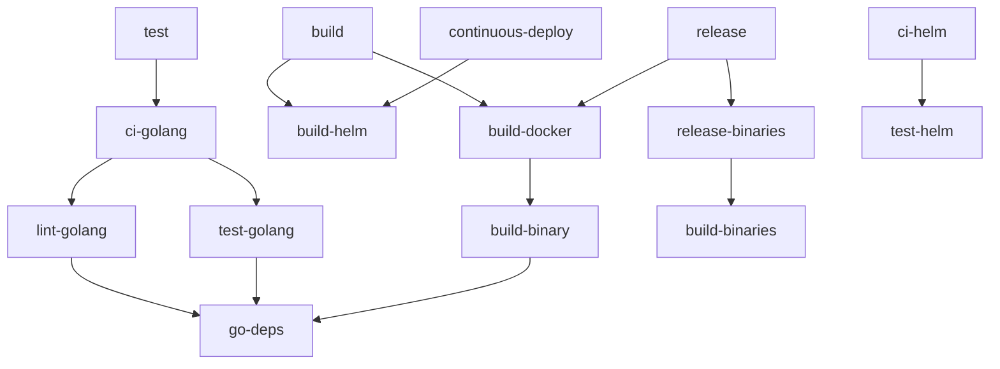

```mermaid
graph TD
        build --> build-docker
        build --> build-helm
        build-docker --> build-binary
        continuous-deploy --> build-helm
        lint-golang --> go-deps
        test-golang --> go-deps
        test --> ci-golang
        release --> build-docker
        release --> release-binaries
        build-binary --> go-deps
        ci-golang --> lint-golang
        ci-golang --> test-golang
        ci-helm --> test-helm
        release-binaries --> build-binaries
```
