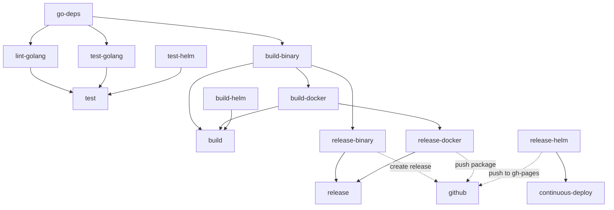

```mermaid
graph TD
    lint-golang --> test
    test-golang --> test
    test-helm --> test
    
    build-binary --> build
    build-docker --> build
    build-helm --> build
    
    build-binary --> build-docker
    release-binary --> release
    release-binary -.create release.-> github
    release-docker --> release
    release-docker -.push package.-> github
    
    build-binary --> release-binary
    build-docker --> release-docker
    
    release-helm --> continuous-deploy
    release-helm -.push to gh-pages.-> github
    
    go-deps --> build-binary
    go-deps --> lint-golang
    go-deps --> test-golang
```
