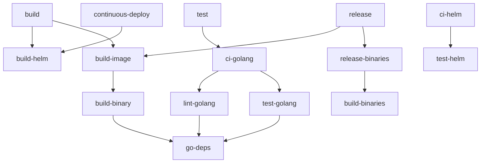

```mermaid
graph TD
	build --> build-helm
	build --> build-image
	build-binary --> go-deps
	build-image --> build-binary
	ci-golang --> lint-golang
	ci-golang --> test-golang
	ci-helm --> test-helm
	continuous-deploy --> build-helm
	lint-golang --> go-deps
	release --> build-image
	release --> release-binaries
	release-binaries --> build-binaries
	test --> ci-golang
	test-golang --> go-deps
```
